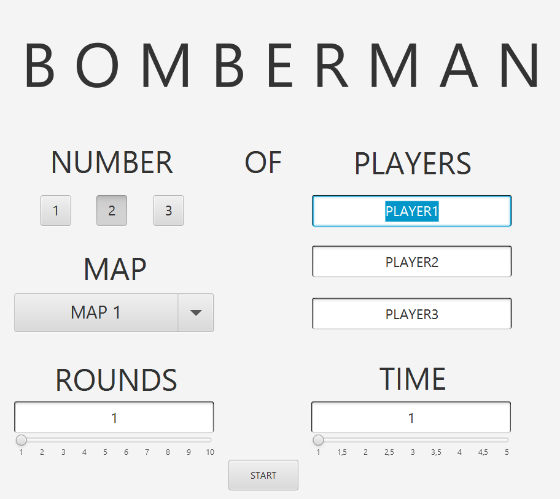
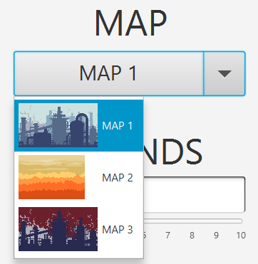

# Bomberman
JavaFX game based on the MVC concept (Bomber Model, Bomber View, Bomber Controller). 

A Bomberman game for one to three players.
At the beginning of the game, a start window appears with the option to enter the names of players, number of rounds, number of players, time for one round and map selection.
* The game is played over a certain number of rounds.
* A specific time is allocated for each round.
* During this time, each player can move and place bombs on the board.
* After the bomb explodes, it destroys destructible walls, as well as players who fall under its fire.
* After destroying the wall, a bonus may appear, which can be collected by the player or destroyed by a bomb.
* There are two types of bonuses: speed booster and bomb booster (increasing the maximum number of active bombs. At the beginning each player can only plant one active bomb).
* The player who remains alive wins the round. Otherwise, no winner is determined.
* The player with the most wins rounds wins the game.
## View
### Game

### Player move

### Fire

### Info label
The current information is at the top of the game
* player names
* the number of rounds won by each player
* the number of rounds lost by each player
* the current time of the game
* current round
* end of the round
* end of the game with the player who won

At the bottom there is information about the keys

## Player keys
|     PLAYER     |  UP   | DOWN  | LEFT  | RIGHT | BOMB  |
| :------------: | :---: | :---: | :---: | :---: | :---: |
| ![player1][p1] |  `↑`  |  `↓`  |  `←`  |  `→`  |`SHIFT`|
| ![player2][p2] |  `W`  |  `S`  |  `A`  |  `D`  | `TAB` |
| ![player3][p3] |  `U`  |  `J`  |  `H`  |  `K`  |`SPACE`|

[p1]: src/main/resources/com/bomber/bomberman/img/player-1.png
[p2]: src/main/resources/com/bomber/bomberman/img/player-2.png
[p3]: src/main/resources/com/bomber/bomberman/img/player-3.png
## Bombs
* You can't go through it
* It explodes after a few seconds
* Blast fire destroys fragile walls and players hitting the fire
* After a few seconds, the bomb's fire action ends

| Bomb  | Fire  | RIP   |
| :---: | :---: | :---: |
| ![bomb][bomb] | ![fire][fire] | ![rip][rip]

[bomb]: src/main/resources/com/bomber/bomberman/img/bomb.png
[fire]: src/main/resources/com/bomber/bomberman/img/fire.png
[rip]: src/main/resources/com/bomber/bomberman/img/rip.png
## Bonuses
* Bonuses can appear in the place of a _wall destroyed_ by a bomb.
* Catching a bonus by a player _increases its characteristics_ depending on the bonus type.
* The bonus can be _destroyed_ by a bomb explosion.
* **At the end of the round**, all player characteristics are _reset_ to their initial values.

|     Type      | Image | Description |
| :-----------: | :---: | :---------: |
| Speed booster |    | your speed increases |
| Bombs booster |    | you can set up more bombs at the same time |

## Initial window
Wszystkie wartości ustawione na domyślne.
* Ilość graczy: 1-3
* Mapy
* Ilość rund
* Imiona graczy
* Czas na jedną rundę

## Tools
* JavaFX
* Maven
* Timers
